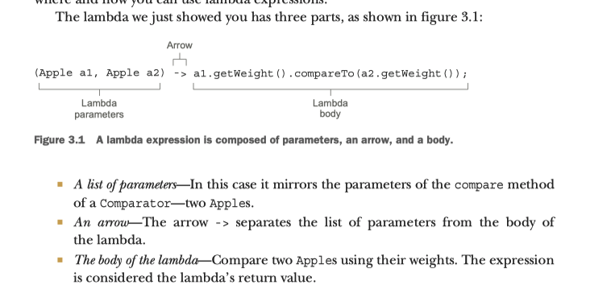
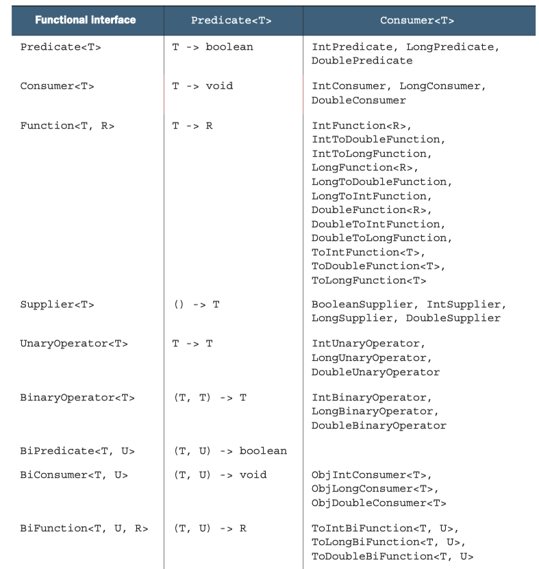
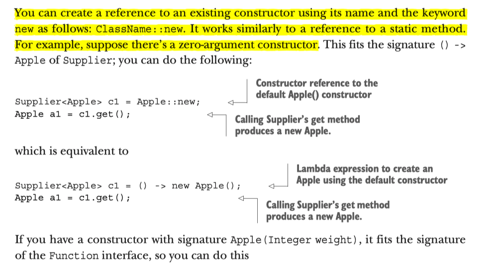

```java
(parameters) -> expression
```

```java
(parameters) -> { statements;}
```

In a nutshell, a functional interface is an interface that specifies exactly one abstract method.


## Functional Interface

If you explore the new Java API, you will notice that functional interfaces are generally annotated with @FunctionalInterface. (We show an extensive list in section 3.4, where we explore how to use functional interfaces in depth.) This annotation is used to indicate that the interface is intended to be a functional interface and is therefore useful for documentation.

You should be aware of boxing and unboxing, when it comes to java programming. There is a conversion between primitive type and generic type, which comes at a performance cost.



## Exceptions

You may throw execptions in side the lambda function, or you can have your own functional interface, and try to catch it with the thrower.

## Type Checking

`(Apple apple) -> apple.getWeight() > 150`


## Closure and using local variables

## Constructor Reference



